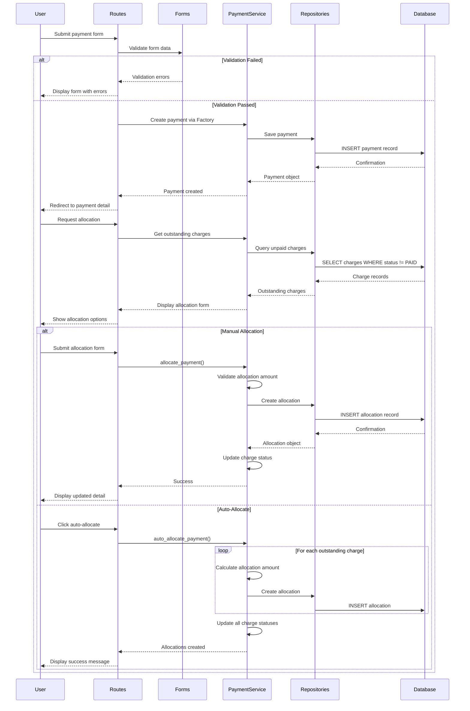

### Swimlane Diagram - Payment Processing by Component

This swimlane diagram shows how different components of the system interact during payment processing.

```mermaid
sequenceDiagram
    participant U as User
    participant R as Routes
    participant F as Forms
    participant S as PaymentService
    participant P as Repositories
    participant D as Database

    U->>R: Submit payment form
    R->>F: Validate form data
    alt Validation Failed
        F-->>R: Validation errors
        R-->>U: Display form with errors
    else Validation Passed
        R->>S: Create payment via Factory
        S->>P: Save payment
        P->>D: INSERT payment record
        D-->>P: Confirmation
        P-->>S: Payment object
        S-->>R: Payment created
        R-->>U: Redirect to payment detail

        U->>R: Request allocation
        R->>S: Get outstanding charges
        S->>P: Query unpaid charges
        P->>D: SELECT charges WHERE status != PAID
        D-->>P: Charge records
        P-->>S: Outstanding charges
        S-->>R: Display allocation form
        R-->>U: Show allocation options

        alt Manual Allocation
            U->>R: Submit allocation form
            R->>S: allocate_payment()
            S->>S: Validate allocation amount
            S->>P: Create allocation
            P->>D: INSERT allocation record
            D-->>P: Confirmation
            P-->>S: Allocation object
            S->>S: Update charge status
            S-->>R: Success
            R-->>U: Display updated detail
        else Auto-Allocate
            U->>R: Click auto-allocate
            R->>S: auto_allocate_payment()
            loop For each outstanding charge
                S->>S: Calculate allocation amount
                S->>P: Create allocation
                P->>D: INSERT allocation
            end
            S->>S: Update all charge statuses
            S-->>R: Allocations created
            R-->>U: Display success message
        end
    end
```